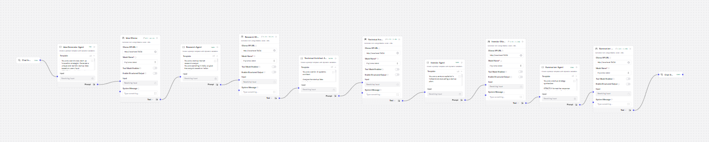

# AI Startup Strategy Engine — Version 1

## Project Overview

The AI Startup Strategy Engine is a sequential multi-agent AI orchestration platform built using Langflow and Ollama with locally hosted Large Language Models (LLMs).

The platform simulates an AI-powered startup boardroom where multiple specialized AI agents collaboratively generate, analyze, evaluate, and refine startup ideas into a complete business and technical blueprint.

The system demonstrates:
- Agentic AI workflows
- Multi-agent orchestration
- Sequential reasoning
- Prompt chaining
- Local LLM execution
- Context propagation
- Workflow automation

---

# Objective

The objective of Version 1 was to create a functioning multi-agent AI workflow capable of transforming a simple startup idea into a structured startup strategy document using chained AI agents.

The workflow was designed to:
1. Accept startup-related user input
2. Generate startup concepts
3. Perform market research analysis
4. Analyze technical feasibility
5. Evaluate investment potential
6. Generate a final startup blueprint

---

# Prerequisites

Before running the project, the following tools and technologies must be installed and configured.

---

# Python Installation

Install Python 3.10 or above.

Verify installation:

```bash
python --version
```

---

# VS Code Installation

Install:
- Visual Studio Code
- Python Extension for VS Code

---

# Shared Python Virtual Environment Setup

A shared Python virtual environment was used for all AI-related projects.

## Create Virtual Environment

```bash
python -m venv venv
```

---

## Activate Virtual Environment

### Windows PowerShell

```powershell
.\venv\Scripts\Activate.ps1
```

### Windows CMD

```cmd
venv\Scripts\activate
```

---

## Verify Virtual Environment

After activation:

```plaintext
(venv)
```

should appear before the terminal path.

---

# Langflow Installation

Install Langflow inside the activated virtual environment.

```bash
pip install langflow
```

---

# Additional Dependency Installation

Install LangChain and Ollama integration libraries.

```bash
pip install langchain langchain-community ollama
```

---

# Ollama Installation

Install Ollama from the official website:

https://ollama.com

---

# Start Ollama Server

Run:

```bash
ollama serve
```

This starts the local AI inference server.

---

# Download Local LLM Models

## TinyLlama

```bash
ollama pull tinyllama
```

---

## Qwen2:0.5b

```bash
ollama pull qwen2:0.5b
```

---

# Running Langflow

After activating the virtual environment:

```bash
langflow run
```

Langflow launches locally in the browser.

---

# Workflow Architecture

```plaintext
User Input
   ↓
Idea Generator Agent
   ↓
Research Agent
   ↓
Technical Architect Agent
   ↓
Investor Agent
   ↓
Final Summarizer Agent
   ↓
Startup Blueprint Output
```

Each agent contains:
- Prompt Template node
- Ollama model node

The output from one agent becomes the input for the next agent, creating a sequential reasoning pipeline.

---

# Workflow Construction Process

## Step 1 — Chat Input

The workflow begins with a Chat Input node where users provide startup-related prompts.

Example:

```plaintext
AI tutor for rural education
```

---

## Step 2 — Prompt Template Nodes

Each agent was implemented using a dedicated Prompt Template node containing specialized instructions.

Examples:
- Idea generation
- Market research
- Technical architecture
- Investor analysis
- Final summarization

---

## Step 3 — Ollama Nodes

Every Prompt Template node was connected to an independent Ollama node.

Purpose:
- perform reasoning
- generate outputs
- simulate specialized AI agents

---

## Step 4 — Sequential Context Passing

Outputs generated by one agent were passed into the next agent.

This created:
- layered reasoning
- prompt chaining
- context propagation

---

# Technologies Used

| Component | Technology |
|---|---|
| Workflow Framework | Langflow |
| AI Runtime | Ollama |
| LLM Model | TinyLlama / Qwen2:0.5b |
| Programming Language | Python |
| Development Environment | VS Code |
| Workflow Type | Sequential Multi-Agent |
| Execution Mode | Local Offline Inference |
| AI Communication Style | Prompt Chaining |

---

# Agent Descriptions

## 1. Idea Generator Agent

### Purpose
Generates startup concepts from user input.

### Responsibilities
- Startup naming
- Problem identification
- User targeting
- Product ideation
- Innovation generation
- Uniqueness analysis

---

## 2. Research Agent

### Purpose
Analyzes market feasibility and business potential.

### Responsibilities
- Market demand analysis
- Competitor analysis
- Industry trends
- Growth opportunities
- Market risks

---

## 3. Technical Architect Agent

### Purpose
Designs technical implementation strategies.

### Responsibilities
- Tech stack recommendation
- Infrastructure planning
- API recommendations
- Security analysis
- MVP roadmap generation

---

## 4. Investor Agent

### Purpose
Evaluates monetization and investment feasibility.

### Responsibilities
- Revenue model analysis
- Funding feasibility
- Scalability analysis
- Profitability estimation
- Business risk evaluation

---

## 5. Final Summarizer Agent

### Purpose
Combines all agent outputs into a unified startup blueprint.

### Responsibilities
- Strategic synthesis
- Blueprint generation
- Executive summary generation
- Final recommendation creation

---

# Summarizer Formatting Improvement

Initially, the summarizer generated poorly formatted long paragraphs because smaller local LLMs struggled with long-context structured generation.

To solve this issue:
- strict markdown headings were introduced
- formatting instructions were made explicit
- concise response instructions were added

Updated summarizer prompts significantly improved readability and structure.

---

# Workflow Execution Logic

The workflow operates sequentially.

Each agent:
1. Receives context from previous agent
2. Performs specialized reasoning
3. Generates structured output
4. Passes output to next agent

This demonstrates:
- layered AI reasoning
- context propagation
- multi-agent orchestration
- workflow automation

---

# Why Multiple Ollama Nodes Were Used

Each agent contains an independent Ollama inference stage because every agent performs a separate reasoning operation.

Benefits:
- isolated reasoning
- modular architecture
- specialized analysis
- scalable workflow design

This architecture reflects real-world agentic AI orchestration systems.

---

# Runtime Metrics

| Agent | Prompt Purpose | Ollama Model | Prompt Processing Time | Ollama Inference Time | Individual Agent Runtime | Cumulative Workflow Runtime |
|---|---|---|---|---|---|---|
| Idea Generator Agent | Generate startup concept | TinyLlama | 7 ms | 41.1 sec | 41.1 sec | 41.1 sec |
| Research Agent | Analyze market and competitors | TinyLlama | 14 ms | 9.1 sec | 9.1 sec | 50.2 sec |
| Technical Architect Agent | Generate technical architecture | TinyLlama | 142 ms | 45.8 sec | 45.8 sec | 1.6 min |
| Investor Agent | Evaluate monetization and scalability | TinyLlama | 14 ms | 16 sec | 16 sec | 1.26 min |
| Final Summarizer Agent | Generate final startup blueprint | TinyLlama | 18 ms | 1.02 min | 1.02 min | 2.28 min |

---

# Final Workflow Metrics

| Metric | Value |
|---|---|
| Total Agents | 5 |
| Workflow Type | Sequential Multi-Agent |
| Total Workflow Runtime | ~2.28 min |
| Execution Mode | Local Offline Inference |
| Context Passing | Enabled |
| Pipeline Depth | 5 Layers |
| AI Runtime | Ollama |
| Orchestration Framework | Langflow |

---

# Key Features Implemented

| Feature | Status |
|---|---|
| Multi-Agent Workflow | Implemented |
| Sequential Prompt Chaining | Implemented |
| Local LLM Execution | Implemented |
| Context Passing | Implemented |
| Structured AI Roles | Implemented |
| Startup Blueprint Generation | Implemented |
| Workflow Automation | Implemented |

---

# Challenges Encountered

| Challenge | Explanation |
|---|---|
| Slow Runtime | Sequential local inference increased cumulative latency |
| Formatting Collapse | Small models struggled with long-context summarization |
| Long Context Handling | Later agents received very large prompts |
| Output Consistency | Smaller models occasionally ignored formatting instructions |

---

# Solutions Implemented

| Problem | Solution |
|---|---|
| Poor Formatting | Added strict markdown headings |
| Slow Runtime | Reduced prompt complexity |
| Context Overload | Shortened responses |
| Inconsistent Outputs | Added explicit formatting instructions |
| Weak Summarization | Switched to Qwen2:0.5b |

---

# Key Observations

1. Sequential multi-agent systems improve reasoning depth.
2. Local LLM orchestration is possible without cloud APIs.
3. Prompt engineering strongly affects output quality.
4. Smaller models struggle with long-context consistency.
5. Multi-agent workflows increase cumulative inference latency.
6. Structured prompts significantly improve summarization quality.

